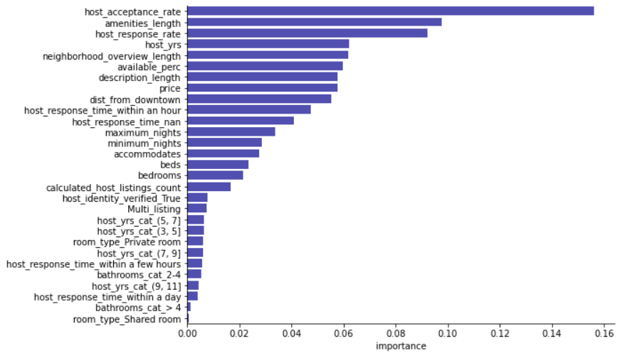

# Austin Airbnb - Using Data to Gain a Competitive Edge

### Introduction
Making your home available on Airbnb can be an intimidating prospect, particularly if you live in a large, hip city where you're forced to compete against thousands of other listings. Such is the case in Austin, TX - a city consistently ranked among the top in the US and among the fastest growing, a city that is swiftly changing to accommodate the influx of technology, a city where keeping it weird is and will always be a higher calling, a city that is my hometown. Though I no longer live in Austin, when I came across the Airbnb data for the city, I was intrigued to take a deeper dive in. The primary question I'm setting out to answer: **Which factors provide a home with a competitive edge?** In other words, how do you actually get people to choose your home, enjoy their stay, and leave a review? Let's see what the data has to say.

### Data files
I downloaded the data from [Inside Airbnb](http://insideairbnb.com/get-the-data.html), which has made the data publicly available. The data I downloaded was scraped on November 7, 2020 and contains price and availability information for each listing through November 7, 2021. Below is a brief description of each of the files. 

1. calendar.csv - Lists availability, price, minimum, and maximum night stays for each listing from November 7, 2020 - November 7, 2021.
2. listings.csv - Listing data across 74 features. Includes measures such as review information, room type, listing price, etc. 
3. reviews.csv - Contains customer reviews for listings and shows the date they were posted. 

### Python Packages Used
1. Pandas
2. Numpy
3. Matplotlib
4. Seaborn
5. Scikit-learn
6. NLTK
7. datetime
8. ast

### Random Forest Classification
I decided to use scikit-learn's Random Forest classifier since it is not limited to forming a linear decision boundary and has some nice properties that combat overfitting. It also has a built in feature importance ranking, which is useful for our purposes. I excluded all predictors related to customer reviews since we already know that is so deeply tied to Superhost status. So without further ado, let's see how we performed and which predictors are most important!

### Performance and Top Predictors
I used 5-fold cross validation to evaluate model performance and used accuracy and AUC (area under the ROC curve) as performance metrics. The average accuracy over the 5 folds was 82% and the average AUC was 0.89. I was actually pretty impressed with the performance, given that I excluded data related to reviews and used the default hyperparameter settings. Below is a plot showing predictors ranked by their importance.

