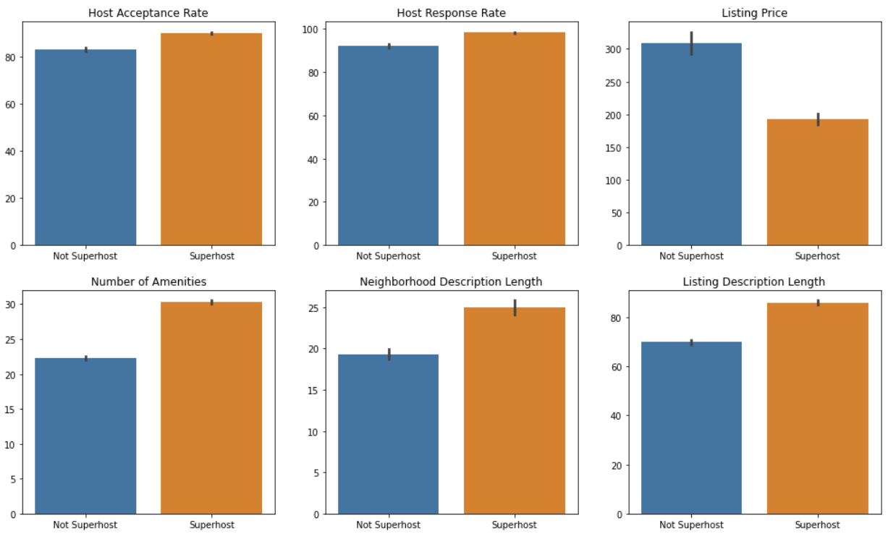

# Austin Airbnb - Using Data to Gain a Competitive Edge

### Introduction
Making your home available on Airbnb can be an intimidating prospect, particularly if you live in a large, hip city where you're forced to compete against thousands of other listings. Such is the case in Austin, TX - a city consistently ranked among the top in the US and among the fastest growing, a city that is swiftly changing to accommodate the influx of technology, a city where keeping it weird is and will always be a higher calling, a city that is my hometown. Though I no longer live in Austin, when I came across the Airbnb data for the city, I was intrigued to take a deeper dive in. The primary question I'm setting out to answer: **Which factors provide a home with a competitive edge?** In other words, how do you actually get people to choose your home, enjoy their stay, and leave a review? Let's see what the data has to say.

### Data files
I downloaded the data from [Inside Airbnb](http://insideairbnb.com/get-the-data.html), which has made the data publicly available. The data I downloaded was scraped on November 7, 2020 and contains price and availability information for each listing through November 7, 2021. Below is a brief description of each of the files. 

1. calendar.csv - Lists availability, price, minimum, and maximum night stays for each listing from November 7, 2020 - November 7, 2021.
2. listings.csv - Listing data across 74 features. Includes measures such as review information, room type, listing price, etc. 
3. reviews.csv - Contains customer reviews for listings and shows the date they were posted. 

### Python Packages Used
1. Pandas
2. Numpy
3. Matplotlib
4. Seaborn
5. Scikit-learn
6. NLTK
7. datetime
8. ast

### Random Forest Classification
I decided to use scikit-learn's Random Forest classifier since it is not limited to forming a linear decision boundary and has some nice properties that combat overfitting. It also has a built in feature importance ranking, which is useful for our purposes. I excluded all predictors related to customer reviews since we already know that is so deeply tied to Superhost status. So without further ado, let's see how we performed and which predictors are most important!

### Performance and Top Predictors
I used 5-fold cross validation to evaluate model performance and used accuracy and AUC (area under the ROC curve) as performance metrics. The average accuracy over the 5 folds was 82% and the average AUC was 0.89. I was actually pretty impressed with the performance, given that I excluded data related to reviews and used the default hyperparameter settings. Below is a plot showing predictors ranked by their importance.

### Competitive Edge Takeaways
Looking at the top predictors, I think there is some good insight to gain a competitive edge. I will focus on things that are directly in the host's control since obviously not everything is. For example, you  can't control how large the home is or where it's located; unless you happen to have the money laying around to buy another house to list. Then good for you! 

I will focus on 6 of the top 8 predictors for Superhost status. 

1. Host acceptance rate
2. Number of amenities offered
3. Host response rate
4. Neighborhood description
5. Listing description
6. Listing price

The takeaways here are quite simple: 
1. Communicate well by actually responding to your potential guests when they request a reservation or have questions. And respond quickly (response time within an hour is also highly ranked). 
2. Take the time to list all amenities your home has to offer, even if they seem like a given. Not every amenity is reasonably within your control but consider adding some extras if you can (e.g., Netflix, Hulu, other entertainment).
3. Always accept the reservation if possible! I realize this is not always in your control and some wisdom should be applied here (e.g., don't accept someone with bad reviews). But don't let laziness or slight inconveniences be the reason your acceptance rate drops.
4. Take the time to paint your home and neighborhood in the best light possible. Describe what you love about the home and the part of town it's located. Mention the good restaurants or bars nearby. Give the extra insight only a local can provide. 
5. Price your listing competitively. The price distributions for the various ZIP codes should be useful here. If you're pricing significantly higher than the median in your area, then you should have a good reason for it.